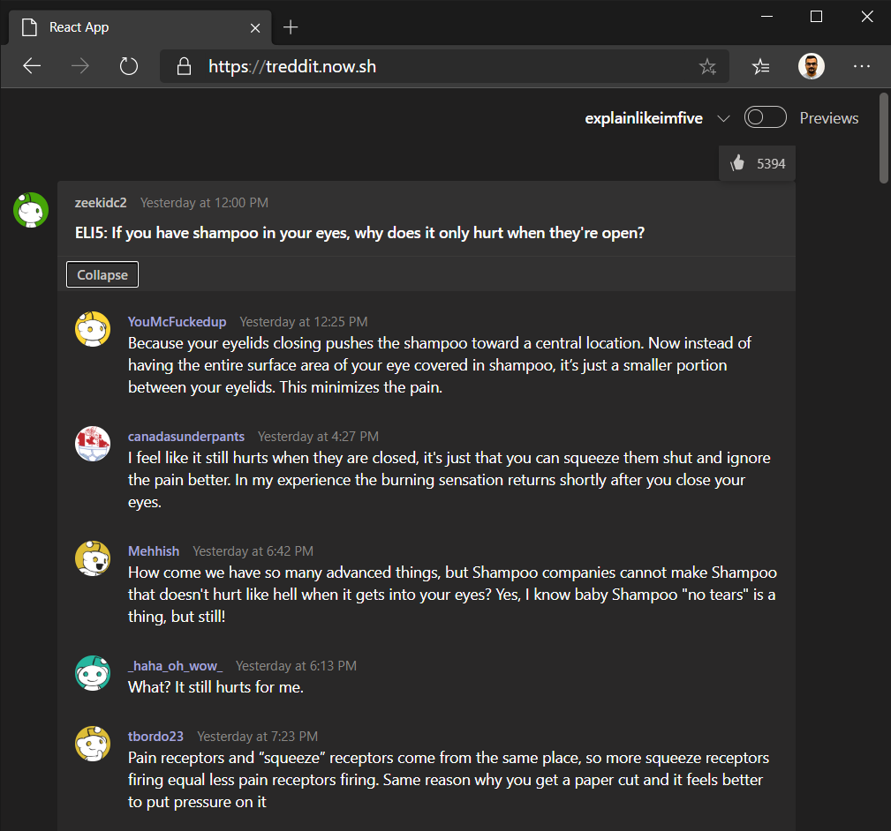
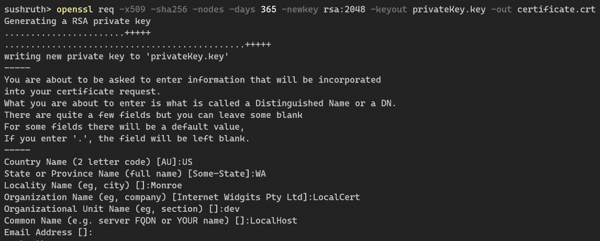
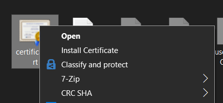
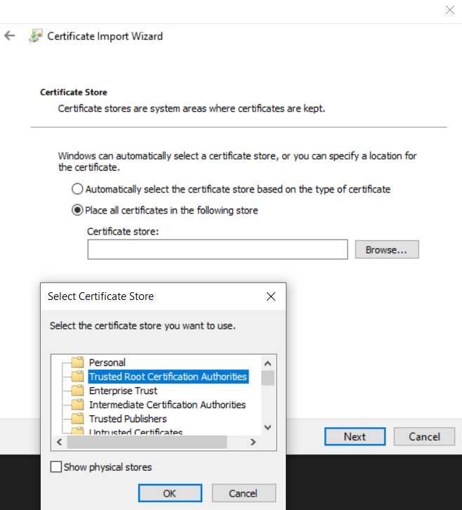
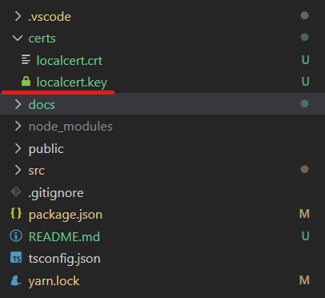

# Reddit within teams

Attempt to create a basic reddit browser with a teams theme.



# How to use?

Add a website tab to any channel in Teams and use https://treddit.now.sh as the URL.

## Development setup

### System setup

1. Have [`scoop`](https://scoop.sh) installed.
2. Install git, nodejs and yarn. I prefer to do this -
   ```sh
   scoop install git
   scoop install nvm
   nvm install latest
   # this should show the installed version after install. Lets call it 13.x.x
   nvm use 13.x.x
   ```
3. Install yarn
   ```
   scoop install yarn
   ```

### Codebase setup

1. Clone the repo and prep it
   ```
   git clone git@github.com:sushruth/teams-reddit.git
   cd teams-reddit
   yarn
   ```

### Certificate setup

2. Install openssl with scoop
   ```sh
   scoop install openssh
   ```
1. Run this to create a local certificate that can work

   ```sh
   openssl req -x509 -sha256 -nodes -days 365 -newkey rsa:2048 -keyout privateKey.key -out certificate.crt
   ```

   This should interactively ask you questions which you could fill with details like so -

   

1. Install the certificate by rightclicking on the crt file and clicking install
   
   

1. copy the crt and key files from wherever they were generated, into the certs directory in your local clone of this repo like so -

   

### Run and test the app

1. Start it

   ```
   yarn start
   ```

2. Open any channel in teams and click on "+" icon to add a tab
3. Click on "website" app
4. Use `https://localhost:3000` as the URL

All good.
